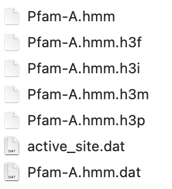
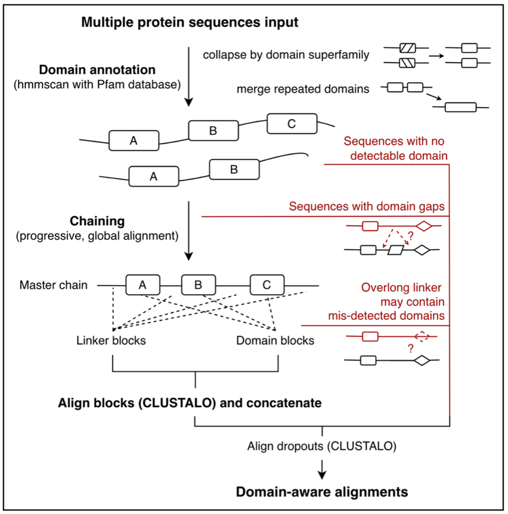

# DAMPSA: Domain-aware Multiple Protein Sequence Aligner

## Roll number: 820

---

__DAMPSA__ is a multiple sequence analysis (MSA) tool that utilises protein domain annotations as 
biological constraints.

DAMPSA generates MSA outputs where protein domains are anchored. This means:

1. Domain and linker segments of the protein will not be mixed by random similarity. 

2. Potentially, _distant_ sequences with _similar_ structures can be aligned.

## Installation

```
conda create -n dampsa python=3.9
conda activate dampsa
```

In project folder (`cd DAMPSA`),
1. Install python libraries through `pip`.

```
pip install -r py_requirements.txt
```

2. Install command line programs through `bioconda`.

```
conda install --file=cmd_requirements.txt -c bioconda
```

3. Prepare the __local Pfam database__ for domain annotation.


   - The following code download Pfam database files and then use `hmmpress` to index them for efficient processing.  
   - _Note_: The ready database will takes ~__3.4 GB__ space.
   - _Note_: The links are updated on 30/05/2022. Check [Pfam](https://pfam.xfam.org/) if any link fails.

```
mkdir data/Pfam_scan_db
cd data/Pfam_scan_db

wget http://ftp.ebi.ac.uk/pub/databases/Pfam/current_release/Pfam-A.hmm.dat.gz
wget http://ftp.ebi.ac.uk/pub/databases/Pfam/current_release/Pfam-A.hmm.gz
wget http://ftp.ebi.ac.uk/pub/databases/Pfam/current_release/active_site.dat.gz
gunzip *.gz

hmmpress Pfam-A.hmm
```

:) You are now ready to run DAMPSA main pipeline.

Further notes:
- The localised Pfam database (`data/Pfam_scan_db`) should has the following structure:

  

- To run visualisation scripts in `R` (not the main pipeline), you need the following packages.
     <details>
      <summary>click here</summary>
      <pre><code>
         tidyverse
         msa
         ggmsa
         RColorBrewer
         Biostrings
         stringr
         getopt
      </code></pre>
      </details>
- DAMPSA is developed and tested on `MacOS 12.1`, `Python 3.9.12`, and `R 4.1.2`.
---

## Getting started (or see a walkthrough tutorial [here](tutorial/walkthrough.html))

In project folder (`cd DAMPSA`),

```
python bin/main.py -h
```

<details>
      <summary>parameter descriptions</summary>
      <pre><code>
 usage: main.py [-h] [--input INPUT] [--output OUTPUT] [--domain-out DOMAIN_OUT] [--refine-edge] [--no-check-linker]
       [--focus-clan FOCUS_CLAN] [--cache-dom CACHE_DOM] [--domain-app DOMAIN_APP] [--linker-app LINKER_APP] [--log]
       [--n-thread N_THREAD]

  DAMPSA input arguments.
        
  optional arguments:
    -h, --help            show this help message and exit
    --input INPUT         Path to the input .fasta file.
    --output OUTPUT       Path to the alignment .fasta file output.
    --domain-out DOMAIN_OUT
                          Path to output domain annotation results.
    --refine-edge         Refine alignments at the edge between domain and linker segments.
    --no-check-linker     Not to check if the linker is too long - likely contains mis-detected domains.
    --focus-clan FOCUS_CLAN
                          Only consider the specified Clan IDs (domain superfamily) - comma separated.
    --cache-dom CACHE_DOM
                          Skip hmmscan, use supplied filepath to cached domain table (TSV-like).
    --domain-app DOMAIN_APP
                          Aligner for domain segments (clustalo or mafft), default clustalo.
    --linker-app LINKER_APP
                          Aligner for linker segments (clustalo or mafft), default clustalo.
    --log                 Store log file in the same folder as the alignment
    --n-thread N_THREAD   Thread number for running hmmscan (domain annotation), default 7.

</code></pre>
</details>


### Run an example command (align the RASSF family)
```
python bin/main.py --input tutorial/RASSF/raw.fasta \
--output tutorial/RASSF/aligned.fasta \
--domain-out tutorial/RASSF/domain.txt \
--no-check-linker --log
```


---
## Architecture



The DAMPSA pipeline involves three stages:

1. Annotating domains with `hmmscan` and [Pfam database](https://pfam.xfam.org/).
2. Chaining domain sequence using progressive global alignment 
   implemented [here](https://github.com/fbkarsdorp/alignment).
3. Align blocks defined by the chain, using [Clustal-Omega](http://www.clustal.org/omega/) (CLUSTALO). 
   These blocks are concantenated to generate full alignment.

In three cases, sequences cannot be considered by DAMPSA. They are dropped out and aligned finally using 
_sequence-to-profile_ method in CLUSTALO.
- Sequences with no domain detected.
- Domain sequences that are gapped (e.g. -A-C- vs. -A-B-C-, the first sequence will be dropped out)
- Sequences with overlong linker which may indicate domain misdetection.

__All dropout cases are logged.__ Please check `log.txt` in DAMPSA output.

---
## API documentation

See [here](doc/build/html/index.html).
