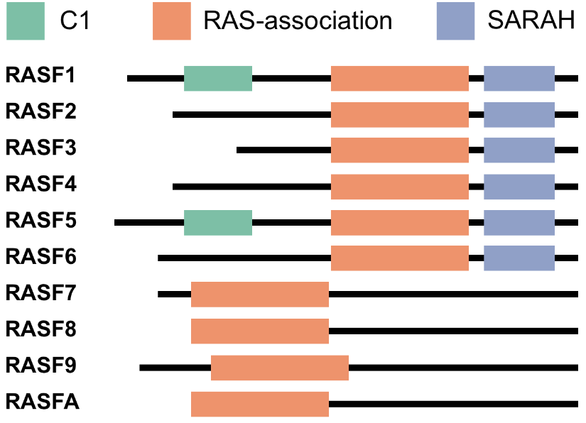
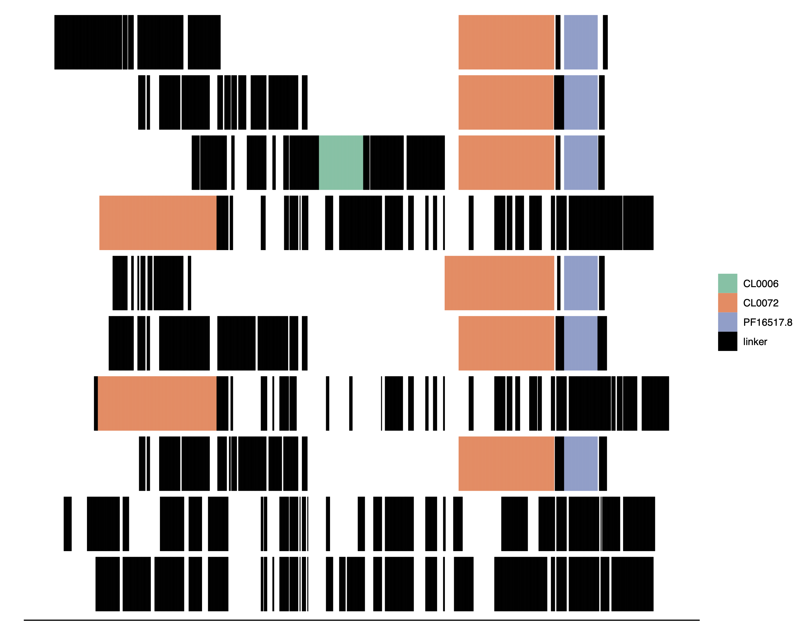
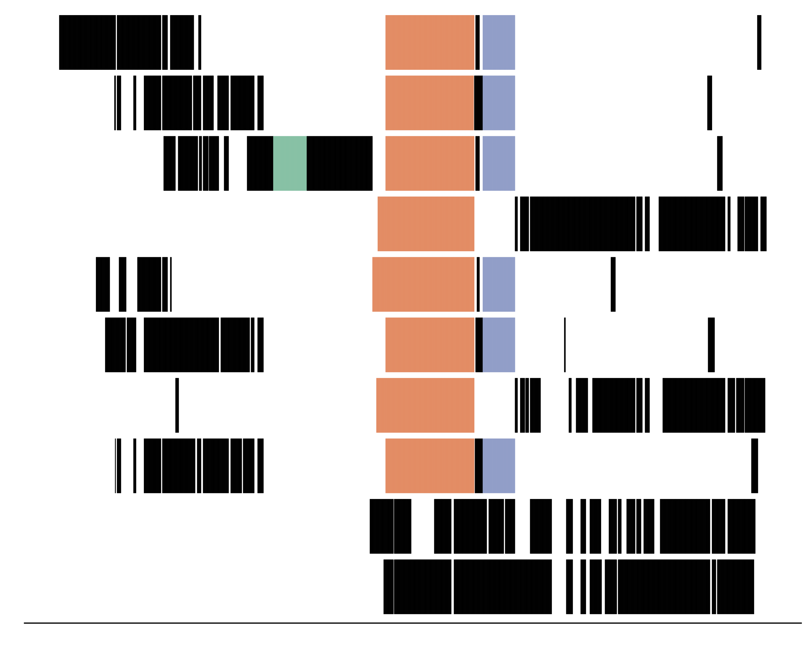
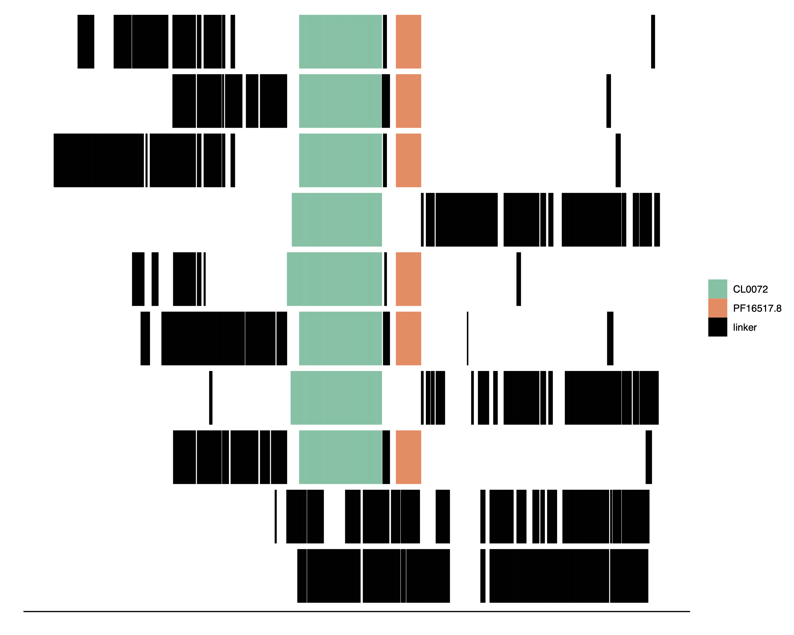
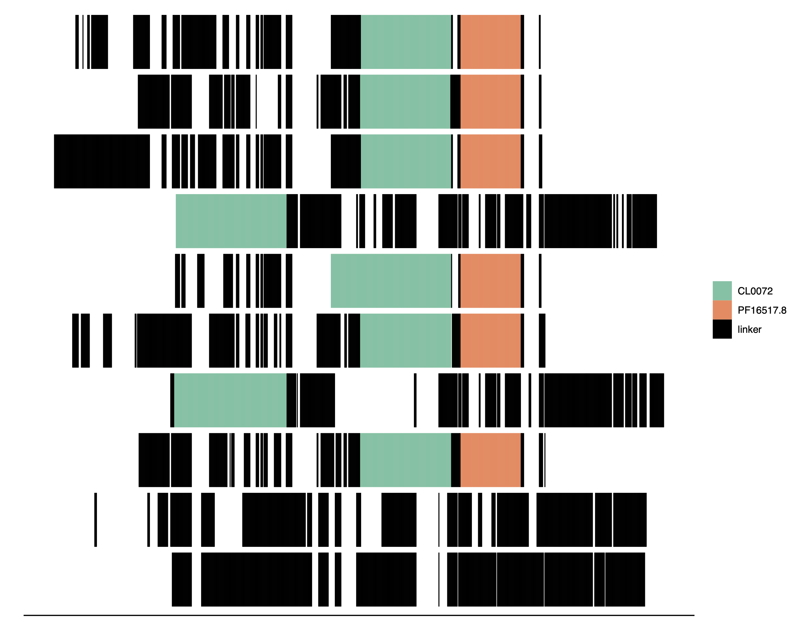

# Walkthrough of DAMPSA main pipeline

Here, I use an example of aligning RASSF to introduce the logic and the parameter setting of DAMPSA.

RASSF is a Ras protein family ([reference](https://doi.org/10.1007/978-1-4614-6438-9_101852-1)), it homes many members with multiple domain architectures. Aligning them with conventional tools like Clustal-Omega is error-prone.



---

## Input & Outputs

You can run DAMPSA through calling `python bin/main.py` in the `DAMPSA` folder.

DAMPSA takes any `.fasta` file that stores multiple protein sequences as the input. 

For example, `tutorial/RASSF/raw.fasta` has ten sequences from the RASSF family (the metadata from UniProt is available in `tutorial/RASSF/meta.txt`).

The input file is specified with `--input`.

DAMPSA outputs three kinds of files:
- The alignment in the format of `.fasta`. The output path is specified with `--output`.
- The domain annotation result in the format of TSV-like `.txt`. The output path is specified with `--domain-out`. It has the following columns:
  - `seq_id` input sequence ID.
  - `clan`: domain superfamily (Pfam Clan).
  - `env_start` and `env_end`: envelope start and end.
  - `PF`: Pfam ID. If merged, there will be multiple.
- The log file. You may find warning information useful, see the _articheture_ section in [README](../README.html). You must turn on logging output with `--log`.

The above parameters allow for a basic run.

```
python bin/main.py \
--input tutorial/RASSF/raw.fasta \
--output tutorial/RASSF/aligned.fasta \
--domain-out tutorial/RASSF/domain.txt --log
```

---
## Visualise the output (optional)

Widely-used software (like [JalView](http://www.jalview.org/)) are easy tools for visualising the alignment. However, they cannot incorporate the domain annotation information.

`analysis/plot_alignment.R` is a convenient script to get an overview of the detected domain architecture. Running this needs R installation and related packages (see [README Installation guide](../README.html)). Config the filepath variables in the script.

- fp: path to DAMPSA output alignment (`.fasta`).
- tb_path: path to DAMPSA domain detection output (`.txt`).

By default, the script will output a plot under a sub-folder of the `.fasta` input called `vis`.

---

If you do visualisation for the `aligned.fasta` and `domain.txt` generated above. You may identify an issue with the alignment.



_(note the order of sequence is not the same as the first picture. You may find `yorder` in `plot_alignment.R` useful for organizing the order.)_

Each row is a sequence (from N- to C-terminal) and aligned regions are coloured. Domains have their own colours. Clearly sequence 4 & 7 have the __orange domain that does not align__ with other sequences'.

This is because of one of the __dropout__ mechanisms in DAMSA, where sequences with too long linker (defined by IQR method, here the C-terminal) will be removed. This design tries to avoid misdetected domain in the abnormally long linker. However, they are still aligned to the profile (alignment of other non-dropout sequences) using default, error-prone, Clustal-Omega.

This behavior is logged as below,
```
WARNING 2 sequences have unreliable domain annotation. Align as a whole later.
WARNING ['sp|Q02833|RASF7_HUMAN', 'sp|Q8NHQ8|RASF8_HUMAN']
```

Working with __sequences having complex domain architecture / heterogenous length__, it is recommended to specify `--no-check-linker` (by default not specified) so that the above checker is silenced.

Run with the following command gives you better output.

```
python bin/main.py \
--input tutorial/RASSF/raw.fasta \
--output tutorial/RASSF/aligned.fasta \
--domain-out tutorial/RASSF/domain.txt \
--log \
--no-check-linker
```



---

## Focus on specific domains

The above alignment still has some issue, in that the green domain of sequence three should actually be aligned to the same domain within sequence 1. However, __the green domain of sequence 1 is not detected__. So the missing domain is aligned together with the N-terminal.

_While fixing the domain detection issue in the future_, the user is allowed to __specify which domain superfamily (Clan), or Pfam ID if no Clan available, to focus on__ with `--focus-clan` (comma separated, see below command).

After checking plot and domain table, the following command gives you further refined output.

```
python bin/main.py --input tutorial/RASSF/raw.fasta \
--output tutorial/RASSF/aligned.fasta \
--domain-out tutorial/RASSF/domain.txt \
--no-check-linker \
--log \
--focus-clan CL0072,PF16517.8
```



Which is better than the raw Clustal-Omega output.



---

## Other commandline options

- `--refine-edge`. Due to the randomness of HMM model, domain annotation at the edge of domain and linker may not be 100% accurate. This option __(default turned on)__ looks for orphan (not matched to any other sequence) residues in the next linker that are identical to the consensus sequence in the end of the current domain. These orphan residues are relocated into domain. It works with minor issue and did not make a big difference when DAMPSA is tested.

- You can also use MAFFT rather than Clsutal-Omega for aligning domain or linker blocks,
through `--domain-app mafft` and/or `--linker-app mafft`. 

- However, the MAFFT embedding has __not__ been tested rigorously,
and the alignment of dropout sequences can only be done with CLUSTALO.
